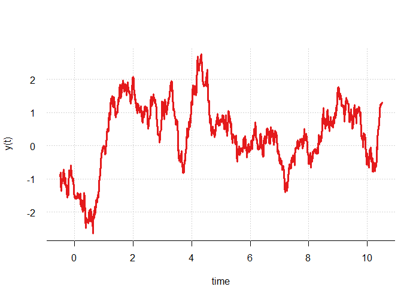
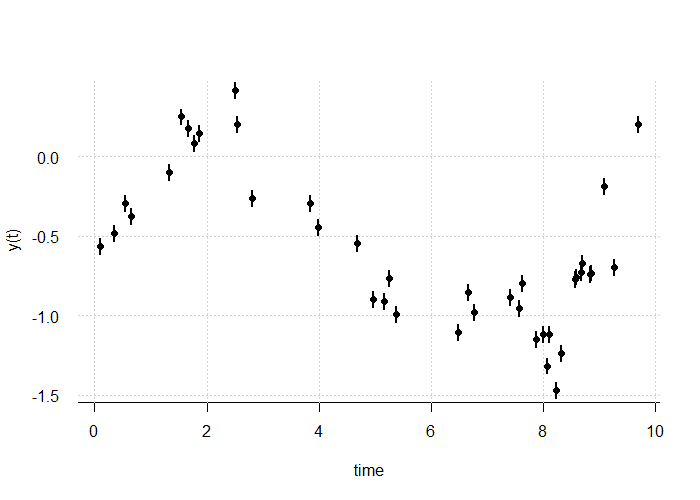
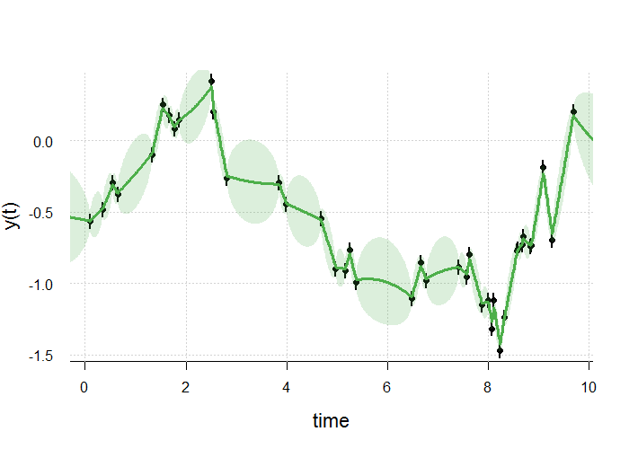
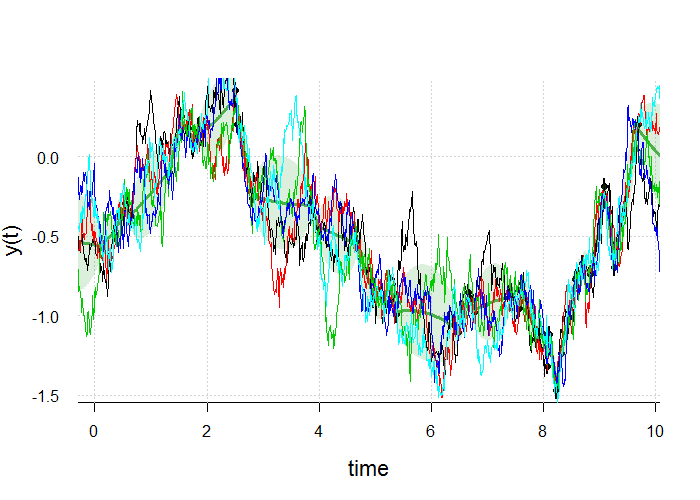
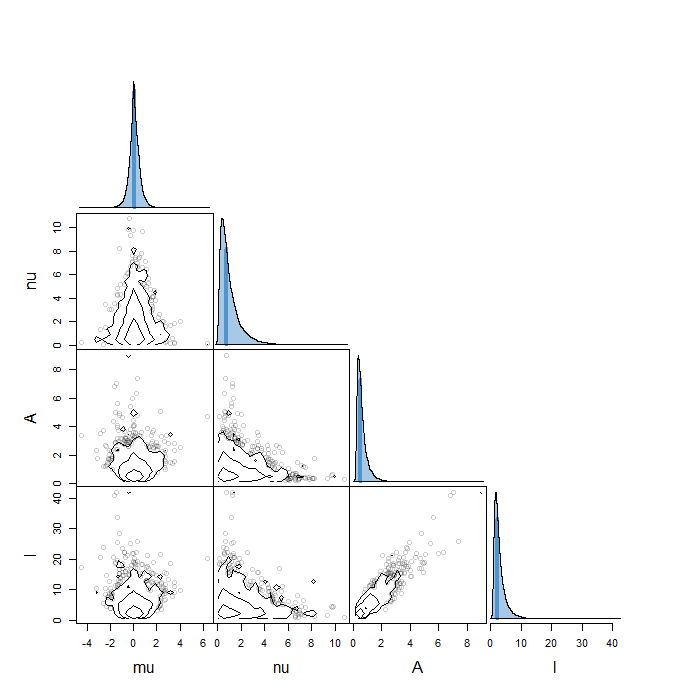

# Gin (Gaussian process Inference)

Gin is a collection of pure R tools for generating and manipulating Gaussian 
Process models (GPs). It is also a nice [spirit](https://en.wikipedia.org/wiki/Gin)


## Outline

The current version includes the top-level functions:

* gp_simulate - generate N psuedo-random GP realisations.

* gp_conditional - compute the mean and covariance of a GP given data points.

* gp_fit - fit for (hyper-)parameters of the autocovariance function (ACV)

* plot_ts - plot a time series data.frame.

* plot_snake - plot a 'snake' representing the mean and std.dev of a GP.

* ts_load - load a plain text data file into an array ready for analysis. 

And some lower-level functions that do the heavy-lifting

* gp_logLikelihood - compute Gaussian log likelihood given data and model.

* gp_logPosterior - compute log posterior, given log likelihood and prior.

* gp_lagMatrix - compute matrix of lags tau_ij = |t_i - t_j|

## Installation

Gin is an R package, but is still in development. To set up from GitHub first 
install (if you haven't already) Hadley Wickham's devtools package.
```
   install.packages("devtools")
```
Now you can install gin straight from GitHub:
```
   devtools::install_github("svdataman/gin")
```
Now you're good to go.

## Simulation

First we must define an ACV function. This is the exponential ACV for a Damped Randon Walk (DRW) process:

```R
   # define an ACV function
   acv <- function(theta, tau) {
     A <- abs(theta[1])
     l <- abs(theta[2])
     acov <- A * exp(-(tau / l))
     return(acov)
   }
```

This accepts a vector of parameters (theta), and a matrix of vector of lags (tau) and returns the ACV value at each lag. 

Now we define some initial parameters

```R
   # define parameters of ACV
   # theta[1] = mu (mean)
   # theta[2] = nu (error scale factor) 
   # theta[3:p] = parameters of ACV
   theta <- c(0.0, 1.0, 1.0, 1.0)
```

Next, we define a list of times at which to compute the simulated data

```R
   # define vector of times for reconstruction
   m <- 1000
   t <- seq(-0.5, 10.5, length = m)
```

Using the ACV model and parameters (theta) as above, and the grid of times (t) we can generate a random realisation of the GP

```
  # produce Gaussian vector (simulation)
  y <- gp_sim(theta, acv.model = acv, t.star = t)
  y <- as.vector(y)

  # plot the 'true' curve
  dat <- data.frame(t = t, y = y)
  plot_ts(dat, type = "l")
```



## Fitting data

The package comes with a dataset called drw. This shows 40 observations of a random process. The drw data.frame has 3 columns: t (time), y (value), dy (error). Let's plot the data

```R
  plot_ts(drw, col = "black", cex.lab=1.4)
```



Using the ACV model above, and the values for theta as our starting guess, we fit:

```R
   # fit the model to the data, find Max.Like parameter values
   result <- gp_fit(theta, acv.model = acv, dat = drw)
```

This should find the maximum likelihood solution. The ACV parameters (for of them in this case) are in result$par. We can use this to reconstruct the GP as follows. 

We can use the gp_conditional function to compute the mean and covariance of the GP, at the simulation time t (above) with the specified ACV model, conditional on the given data.

```R
   # reconstruct process: compute 'conditional' mean and covariance
   gp <- gp_conditional(result$par, acv.model = acv, drw, t.star = t)
```

and now we can overlay the conditional model 

```R
   # plot a 'snake' showing mean +/- std.dev
   plot_snake(gp, add = TRUE, col.line = 3)
```



We can also add psuedo-random realisations of this process (conditional on the data)

```R
   y.sim <- gp_sim(result$par, dat = drw, acv.model = acv, t.star = t, 
                   N.sim = 5, plot = FALSE)
  for (i in 1:5) lines(t, y.sim[, i], col = i)
```




## Bayesian inference

Rather than Maximum Likelihood, we could specify priors on the (hyper-)parameters of the ACV, and peform Bayesian inference. 

```R
   # define the 'priors' for the parameter values
   logPrior <- function(theta) {
     mu.d <- dnorm(theta[1], sd = 5, log = TRUE)
     nu.d <- dlnorm(theta[2], meanlog = 0, sdlog = 1, log = TRUE)
     A.d <- dlnorm(theta[3], meanlog = 0, sdlog = 1, log = TRUE)
     l.d <- dlnorm(theta[4], meanlog = 0, sdlog = 1, log = TRUE)
     return(mu.d + nu.d + A.d + l.d)
   }
```

In general, to do this we need an MCMC tool to sample from the posterior. Here I use the GW sampler from [tonic](https://github.com/svdataman/tonic). 

```R
   # Use gw.mcmc to generate parameter samples
   chain <- tonic::gw_sampler(gp_logPosterior, theta.0 = theta,
                              acv.model = acv, logPrior = logPrior,
                              dat = dat, burn.in = 1e4,
                              nsteps = 20e4,
                              chatter = 1, thin = 10)
```

This takes a minute or two to run. It should produce 2,000 samples after `thinning' by a factor 10 (it generates 20,000 samples but keeps only 1 in 10).
First, we inspect the traces and autocorrelation of the chains.

```R
   # plot MCMC diagnostics
   tonic::chain_diagnosis(chain)
```

Now we can visualise the posterior by plotting the 1 and 2 parameter marginal distributions.

```R
   # name the parameters
   colnames(chain$theta) <- c("mu", "nu", "A", "l")

   # plot scatter diagrams
   tonic::contour_matrix(chain$theta, prob.levels = c(1,2,3), sigma = TRUE,
                         prob1d = 0)
```

The contours represent 1-, 2- and 3-sigma levels (in the sense of 68.3%, 95.4%
and 99.7% of the mass).



## To do

* Inclide a range of ready-to-use ACV functions
* Compute ACFs based on FT of specified PS
* Allow for time binning (not point samples in time)
* Allow for lognormal process

## References

For more on GPs, the best reference is:

* C. E. Rasmussen & K. I. Williams, _Gaussian Processes for Machine Learning_, 
[online here](http://www.gaussianprocess.org/gpml/chapters/)
